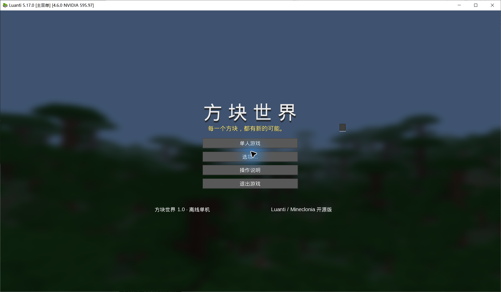
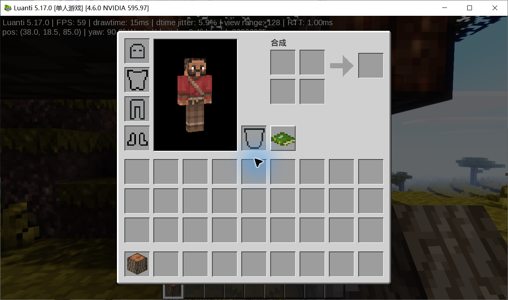

# 方块世界 · Block World CN

基于 **Luanti 5.17.0 + Mineclonia 0.123.1** 的中文离线单机整合与界面定制。GPL-3.0-or-later；上游引擎和媒体保留各自许可。

**首版为 v0.1.0 预发布。** 可进行真实采集、合成、建造和保存；不是 Mojang 官方产品，也尚未达到同一 Minecraft 正式版本的完整复刻。请先阅读 [真实缺项](docs/KNOWN_GAPS.md) 与 [验收说明](docs/TESTING.md)。



## 下载与启动

从 [Releases](https://github.com/vvvvvvvvvashhh/block-world-cn/releases) 下载 `block-world-cn-v0.1.0-windows-x64-offline.zip`，完整解压后双击 **一键启动.cmd** 或 **Start.cmd**。第一次启动会从包内 ZIP 解压依赖，可能需要约一分钟；之后直接启动。游玩无需账号、Java、Python、浏览器或联网。

离线包内同时附带固定版本引擎、游戏及 LGPL 依赖源码。可用同一发行页的 `SHA256SUMS.txt` 校验下载。适用于 Windows x64，本次实测 Windows 10。暂未提供签名安装程序或自动更新器。

GitHub 自动生成的 Source code ZIP 以及 git clone **不含运行时**。源码用户先执行：

```powershell
powershell -NoProfile -ExecutionPolicy Bypass -File scripts/fetch-deps.ps1
.\Start.cmd
```

fetch-deps 会联网下载 dependencies.lock.json 固定的上游包并校验 SHA256；Start.cmd 本身不会联网下载。下载完成后即可离线使用。请先完整解压文件夹，勿直接在压缩软件里运行。

## 操作

WASD 移动，鼠标转向；空格跳跃，Shift 潜行，Ctrl 疾跑；左键挖掘/攻击，右键放置/使用；E 背包，1–9/滚轮快捷栏，Q 丢弃，Esc 暂停；F2 截图、F3 性能、F5 视角。创造模式双击空格切换飞行，空格上升、Shift 下降。

第一天：砍树 → 原木合成木板 → 四格木板制作工作台 → 木棍、木镐 → 采圆石 → 石器和熔炉 → 食物与庇护所。绿色配方书查询真实配方，聊天 `/guide` 查看中文入门。

存档位于 `runtime/luanti-5.17.0-win64/worlds`。正常退出后，启动脚本将全部世界备份至 `backups`；只退到主菜单不会触发整份 ZIP 备份。恢复之前关闭游戏并备份当前目录，再把历史 ZIP 中的世界目录解压至 worlds。备份不自动轮换，需自行管理磁盘空间。

## 当前范围

- 中文单人菜单、世界创建与选项；背包/工作台/熔炉、九格快捷栏和生存 HUD。
- 成熟底座提供分块世界、群系、昼夜天气、采集建造、装备战斗、生物、种植、村庄、红石、维度与创造模式。
- 柔和动态阴影、节点 AO、波动水面、天空反射、雾、色调映射和轻微泛光。
- 默认 1280×720、128 格视距场景观察约 59 FPS；这不是全地图最低帧率保证。

生存材料闭环和保存重载已验证；熔炼使用测试提供的原料。高级红石、村民、全部作物/生物、维度通关未完整回归。缺少真实树木/地形水面倒影、SSAO、PBR、写实云和逐像素原版 UI。[完整边界](docs/KNOWN_GAPS.md)。



## 开发与发布

- `src/`：可读的菜单、配置、体验模组及修改后的上游 Lua/翻译。
- `assets/`：预生成的几何 HUD 素材，CC0。
- `overrides.json`：源文件到运行时路径的明确映射。
- `scripts/`：固定依赖下载、离线部署、启动/备份、发布包构建与检查。
- `licenses/`、[NOTICE](NOTICE.md)：上游来源、许可、署名及第三方依赖材料。

普通游玩不需要编译器。修改 src 后重启，setup 会按映射应用定制文件；不要直接修改 runtime 中会被覆盖的对应文件。引擎/完整游戏源码随离线包保存在 downloads，源码构建指引也包含在引擎源码中。本项目使用官方引擎二进制，没有宣称已重编译引擎。

```powershell
python scripts/check.py
python scripts/build-release.py --version v0.1.0
```

构建离线包需先准备 lock 文件列出的依赖。CI 会做结构/隐私/校验检查、Windows PowerShell 语法检查及离线部署冒烟测试，不会伪装成全游戏自动通关。首次 main 推送的发布工作流生成预发布；后续同版本不会覆盖已公开附件。

欢迎中文或英文贡献。请阅读 [贡献指南](CONTRIBUTING.md)、[行为准则](CODE_OF_CONDUCT.md) 与 [安全政策](SECURITY.md)。
