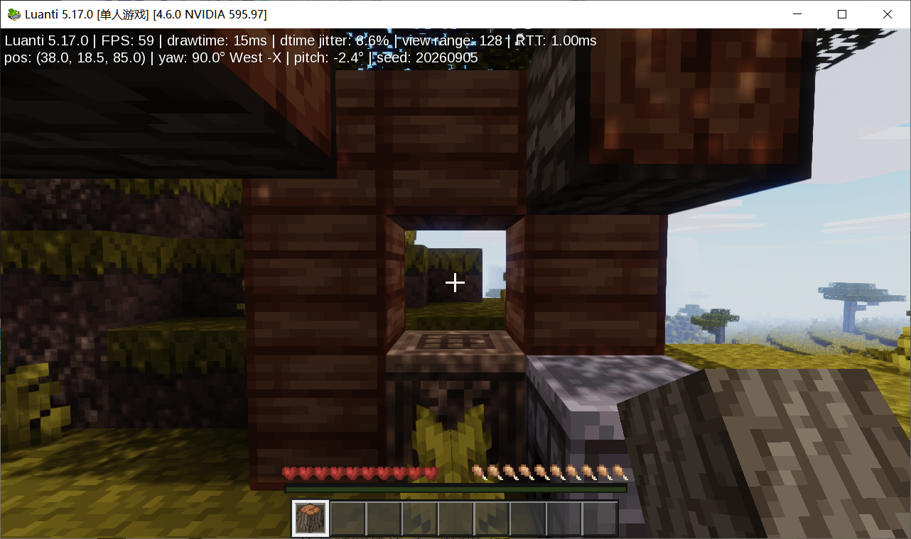
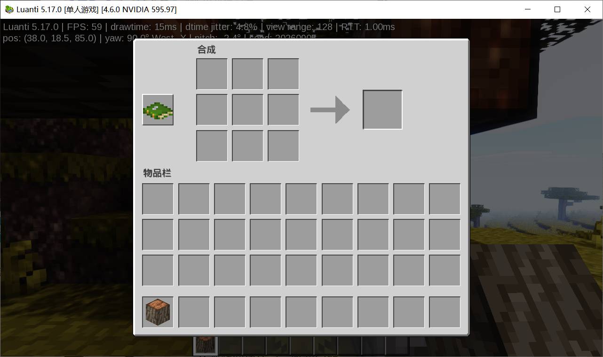

# 真实测试范围

2026-09-06，在 Windows 10 上测试 Luanti 5.17.0 + Mineclonia 0.123.1 及本地定制。下面是已完成的本机验收，不是每次 CI 都会重新执行的通关测试。

| 验证 | 方法和结果 |
|---|---|
| 新建世界 | 中文 GUI 真正创建并进入生存世界 |
| 采集 | 对自然金合欢树调用引擎 node_dig，真实掉落/拾取 4 原木，非创造模式；未自动验证按住鼠标的挖掘时长 |
| 合成 | 在真实 GUI 拖放并取出 16 木板；分放 4 木板做工作台，库存剩 12 木板 + 1 工作台 |
| 建造 | 注册的 on_place 回调使用真实库存放下工作台和 7 木板框架，消耗材料 |
| 熔炼 | 提供测试原铁和煤，真实熔炉节点定时器产出铁锭；不是从零挖铁的完整生存进阶 |
| 退出重载 | 比较背包原木、位置、生命、9 个方块/朝向和熔炉库存，七项检查一致 |
| 存储 | 原工作目录 20 个 SQLite 完整性检查、13 个备份和 3 个安装 ZIP 检查通过；个人存档与日志不公开 |
| 红石回归 | get_power 对普通坐标表/vector 结果一致，观察者邻接通知不再触发缺少 add 方法；并非大电路测试 |
| 启动 | 原离线包恢复、普通启动、重复启动保护与退出备份已实测；公开发布的布局另做部署冒烟检查 |

固定测试镜头/时间和保护仅用于测试世界，公开游玩包没有该测试模组或测试世界。截图均为真实画面，未修饰或生成。默认 1280×720、128 格视距，world.png 中显示约 59 FPS / drawtime 15 ms，仅为场景采样。

水面为天空/光源反射而非树木与地形 SSR；节点 AO 不等于 SSAO。参考图的写实云、完整湖面倒影、原版材质和统一版本逐像素 UI 均未达到。高级生物/种植/村庄/红石/维度通关尚未完整实测。

公开 CI 只检查源码结构、路径安全、个人数据排除、依赖校验、PowerShell 语法和引擎离线部署/版本启动。它不会把静态模块存在冒充为玩法通过。原始失败日志和个人世界只保留在开发者本机。
